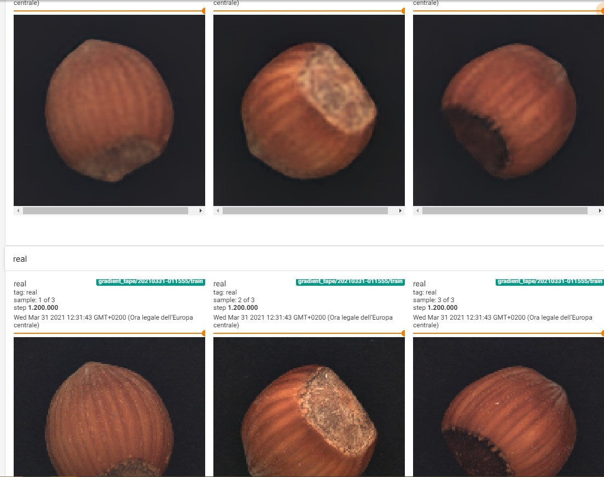

# Anomaly Detection with Adversial Nets

## 31/03/2021

We have an almost working generative model:



### Nets:
4 neural networks: 1 encoder, 1 decoder (generator), 2 discriminators (1 on latent code, 1 on reconstructed images).

* Encoder+Decoder(generator) trained with reconstruction loss (L2).
* Encoder+Discriminator(Latent) trained adversarially in order to regularize the latent space to fit a normal distribution.
* Decoder(generator)+Discriminator(reconstructed images) trained adversarially in order to improve generation process (using Ian's GAN losses)

### Problems:
* Losses seems so stays constant at one point in training (same for generator adversarial loss): 
* Images are still blurred

### Possible improvements:
* WGAN-GP
* Train discriminator every k steps
* BatchNormalization after activation function (but this still needs to be investigated)

## 06/04/2021

During training loop models now are called with proper `training` flag, example:

```python
D_real_result = discriminator(images, training=d_train)
D_real_loss = bce(valid, D_real_result)

z = K.backend.random_normal([batch_size, latent_size]) # z with mean=0, std=1
x_fake = generator(z, training=g_train)
D_fake_result = discriminator(x_fake, training=d_train)
D_fake_loss = bce(fake, D_fake_result)
```

This was needed because `BatchNormalization` layers (used in all nets in the model) behaves differently depending on if it is training or not.
This seems to have solved the issue that would lead to constant losses.

Discriminator is trained every 5 training steps of the generator.

Images have not changed too much.

## 09/04/2021

WGAN-GP is implemented in generator and reconstruction discriminator.
Discriminator is trained 5 times more than generator.

Reconstructions are pretty good but we need metrics to evaluate them.

### What to do next
* Find and implement metrics (for both reconstructions and anomaly detection)
* Use WGAN-GP also in encoder and latent-discriminator