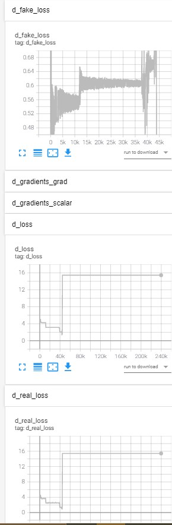

# Anomaly Detection with Adversial Nets

## 31/03/2021

We have an almost working generative model:

### Nets:
4 neural networks: 1 encoder, 1 decoder (generator), 2 discriminators (1 on latent code, 1 on reconstructed images)

### Problems:
* Losses seems so stays constant at one point in training (same for generator adversarial loss): 
* Images are still blurred

### Possible improvements:
* WGAN-GP
* Train discriminator every k steps
* BatchNormalization after activation function (but this still needs to be investigated)